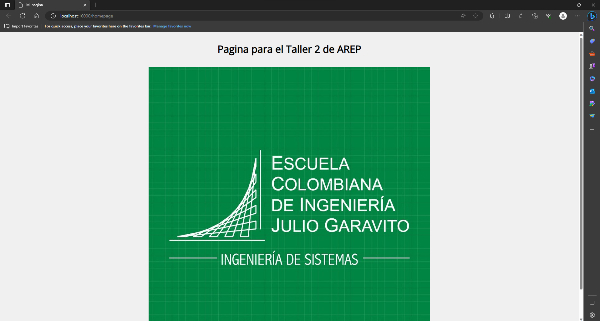

# Movie Search Engine

Movie Search Engine application, a Java-based solution that allows users to effortlessly retrieve details about movies. Powered by the free OMDb API, the program optimizes resource utilization with a built-in caching mechanism, significantly reducing redundant queries. Its architecture features an asynchronous, browser-based client interface using JSON, seamless communication via HTTP, and a user-friendly design crafted using HTML and JavaScript. The project is managed using Maven, Git, and GitHub.


### Architecture

The Movie Search Engine is divided in 4 main components:

#### Web Server with REST API Facade

The web server is divided in 3 components, controllers, used as a intermediary for the webserver and service classes, service, providing the necessary movie services for the app to work, and the webserver, providing the support for communication with the client.

#### External REST API

External web service that provides details about the movies queried.

#### JS Web Client

Web client serves as the graphic user interface for the application

#### Concurrent Java Test Client

A client responsible for testing the concurrency of the applications web server

### Prerequisites

To run the software you will need to have these installed in your machine:

* [Java](https://www.java.com/)
* [Maven](https://maven.apache.org/)

### Installing

Start cloning the GitHub repository, you can use the following command to do so:

```
git clone https://github.com/miguelsalamanca007/Taller1AREP.git
```

Locate yourself in the directory you downloaded the repository in

```
cd /path/to/repo
```

Build and package the project using Maven's package command

```
mvn package
```

## Running the tests

In order to run the test, execute the command

```
mvn test
```

## Running the program

You have already installed the program in the Installing section, now you just need to run the following command  
```
java -cp .\target\primer-taller-1.0-SNAPSHOT.jar edu.escuelaing.arep.app.webserver.WebServer
```

Now you can access the program from your favorite internet browser on port 16000, for that, enter the next URL in the browser:

```
http://localhost:16000/
```

If you have done everything correctly, the program should look like this:



## Built With

* [Java](https://www.java.com/) - The programming language used
* [HTML](https://html.com/document/) - The markup language used for the home's page structure
* [JavaScript](https://www.javascript.com/) - The programming language used for the front's page logic
* [Maven](https://maven.apache.org/) - Dependency Management
* [JUnit](https://junit.org/junit5/) - Used to create unit tests

## Versioning

I use [Git](https://git-scm.com/) for versioning.

## Authors

* **Miguel Angel Salamanca**  - [GitHub](https://github.com/miguelsalamanca007) - [LinkedIn](https://linkedin.com/miguel)

